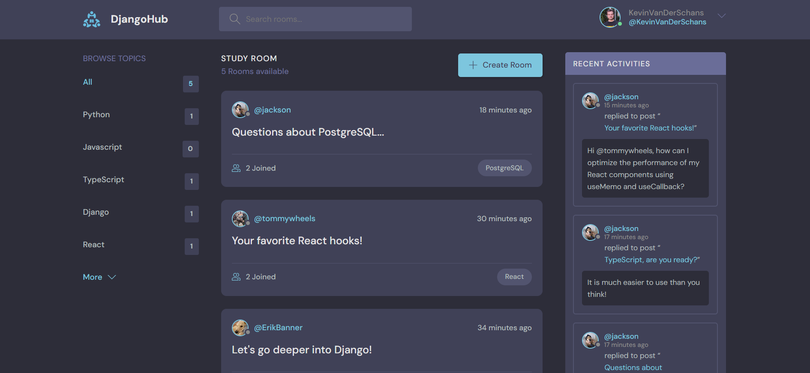

# DjangoHub - social media

## Django / Python

<br>

<div align="center">
  
</div>

<br>

<div>

    DjangoHub is a social network for discussing web technologies,
    with both backend and frontend built using Django.

</div>

<br>
<br>

# Index

- [DjangoHub - social media](#djangohub---social-media)
  - [Django / Python](#django--python)
- [Index](#index)
  - [Features](#features)
  - [Technologies and Tools used](#technologies-and-tools-used)
- [Project Setup](#project-setup)
  - [Prerequisites](#prerequisites)
  - [Clone the repository](#clone-the-repository)
  - [Set up the virtual environment](#set-up-the-virtual-environment)
  - [Install dependencies](#install-dependencies)
  - [Set up the database](#set-up-the-database)
  - [Create a superuser](#create-a-superuser)
  - [.env file](#env-file)
  - [Run the development server](#run-the-development-server)
  - [Access the application](#access-the-application)
  - [Contribution](#contribution)
  - [Project Status](#project-status)
  - [Project Developer](#project-developer)

<br>

## Features

<div>

    ✔️ Register and log in users

    ✔️ Authentication and restricted routes

    ✔️ Edit your profile

    ✔️ CRUD with your own chat room

    ✔️ CRUD with your own messages

    ✔️ Chat room with real-time messages and participants

    ✔️ Filter chat rooms by text input

    ✔️ Browse topics with room count

    ✔️ Recent activities with sorted comments

    ✔️ Flash messages, responsive design, accessibility and SEO.

</div>

<br>

## Technologies and Tools used

<div align="center">
  <br>
    <a href="https://www.djangoproject.com/" target="_blank" rel="noreferrer"> </a>
    <a href="https://www.python.org/" target="_blank" rel="noreferrer"> </a>
    <br>
    <br>
    <a href="https://www.django-rest-framework.org/" target="_blank" rel="noreferrer"> </a>
    <a href="https://www.djlint.com/" target="_blank" rel="noreferrer"> </a>
  <br>
  <br>
</div>

<br>

# Project Setup

These are the instructions to set up and run the Django project in your local environment.

## Prerequisites

1. **Python**: Make sure you have Python 3.6 or higher installed. You can download it from [python.org](https://www.python.org/).
2. **Pip**: Ensure that `pip` is installed. It usually comes pre-installed with Python.
3. **Virtualenv**: It is recommended to use a virtual environment to manage the project dependencies. You can install it with the following command:

    ```sh
    pip install virtualenv
    ```

## Clone the repository

Clone the repository to your local machine using the following command:

```sh
  git clone https://github.com/KevinVanDerSchans/social-media-django.git
```

## Set up the virtual environment

Navigate to the project folder and create a virtual environment:

```sh
    cd social-media-django
    virtualenv env
```

Activate the virtual environment:

• On Windows:

```sh
    .\env\Scripts\activate
```

• On macOS and Linux:

```sh
    source env/bin/activate
```

## Install dependencies

Install the project dependencies using the requirements.txt file:

```sh
    pip install -r requirements.txt
```

## Set up the database

Apply the migrations to set up the database:

```sh
    python manage.py migrate
```

## Create a superuser

Create a superuser to access the Django admin:

```sh
    python manage.py createsuperuser
```

## .env file

Make sure to create a .env file in the project root for the necessary environment variables.

## Run the development server

Run the development server to verify everything is working correctly:

```sh
    python manage.py runserver
```

## Access the application

Open your browser and navigate to http://127.0.0.1:8000/ to see the application running.

<br>

## Contribution

If you want to contribute to this project, follow these steps:

1. Perform a fork to the repository.

2. Create a branch for your feature or bugfix: `git checkout -b feature/your-feature-name`

3. Make the necessary changes and commits: `git commit -m 'Add some feature'`

4. Push to branch: `git push origin feature/your-feature-name`

5. Send a pull request to the original repository.

<br>

## Project Status


<br>

## Project Developer

| [<br><sub>Kevin Schans</sub>](https://github.com/KevinVanDerSchans) |
| :--------------------------------------------------------------------------------------------------------------------------------------------: |
